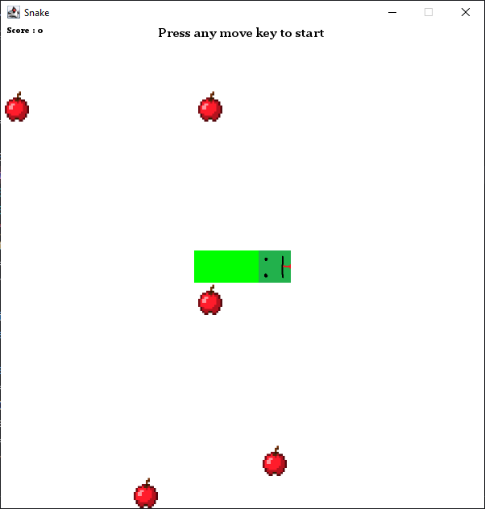
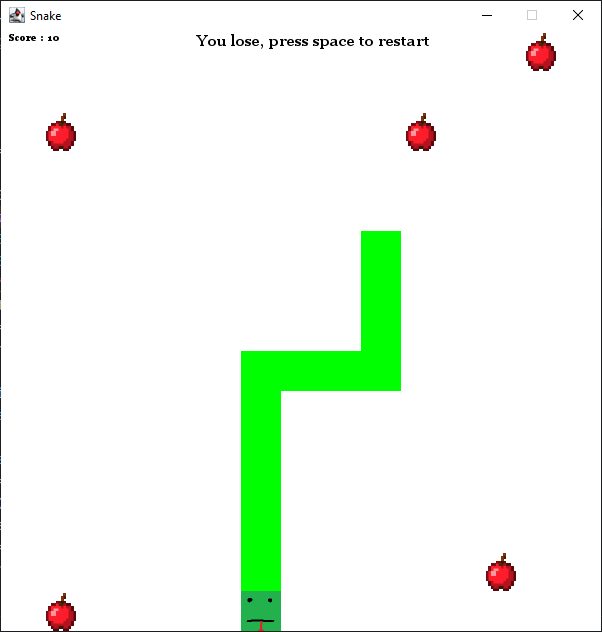

# ScalaSnake

## Description du jeu
Le jeu snake en scala est une version du célèbre jeu snake où le joueur contrôle un serpent qui se déplace sur un plateau et doit manger de la nourriture pour grandir. 
L'objectif est d'éviter de se heurter aux murs ou à son propre corps.

## Screenshots du jeu

## Mode d'emploi
Utiliser les touches "W", "A", "S" et "D" pour vous déplacer sur la grille. 
Pour relancer une partie perdue, cliquer sur la touche espace. 

## Structure du code
- L'objet Game s'occupe de coordonner les différentes classes afin de réaliser le jeu.
- La classe Position stocke des coordonnées X et Y.
- La classe Apples contient les méthodes pour générer les positions des pommes et les stocker.
- La classe Snake  contient les méthodes pour faire situer le serpent, le faire avancer, grandir ou détecter si le serpent va perdre.
- La classe Grid contient les méthodes pour positionner le serpent et les pommes sur la grille.

